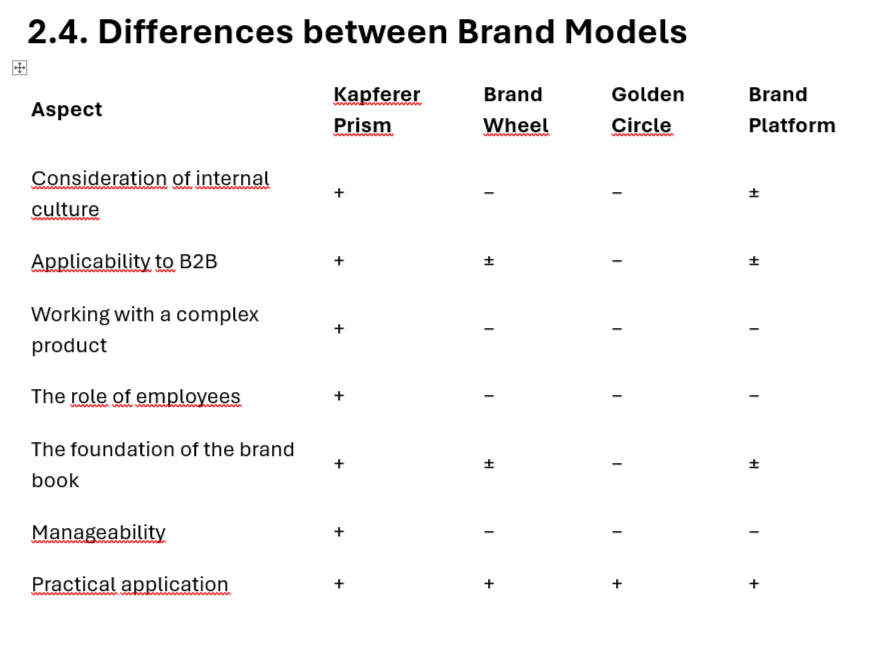
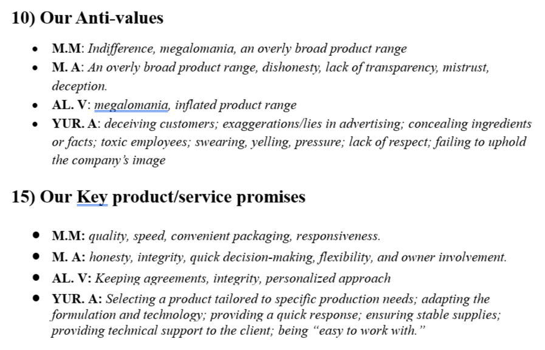
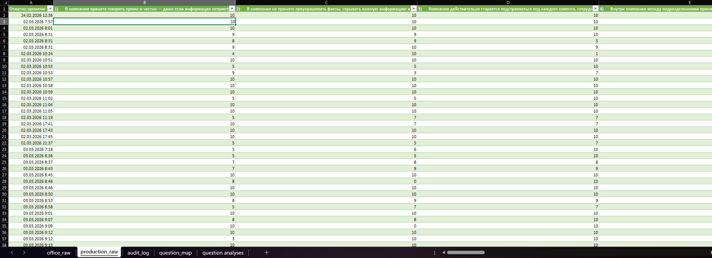
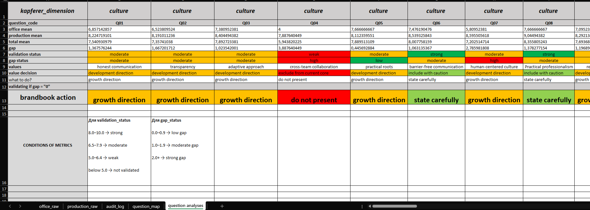
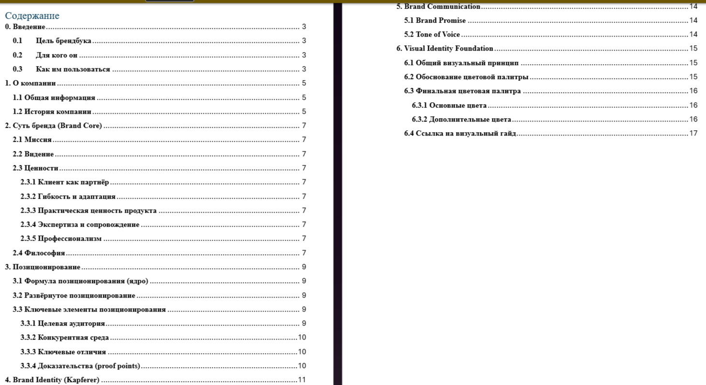
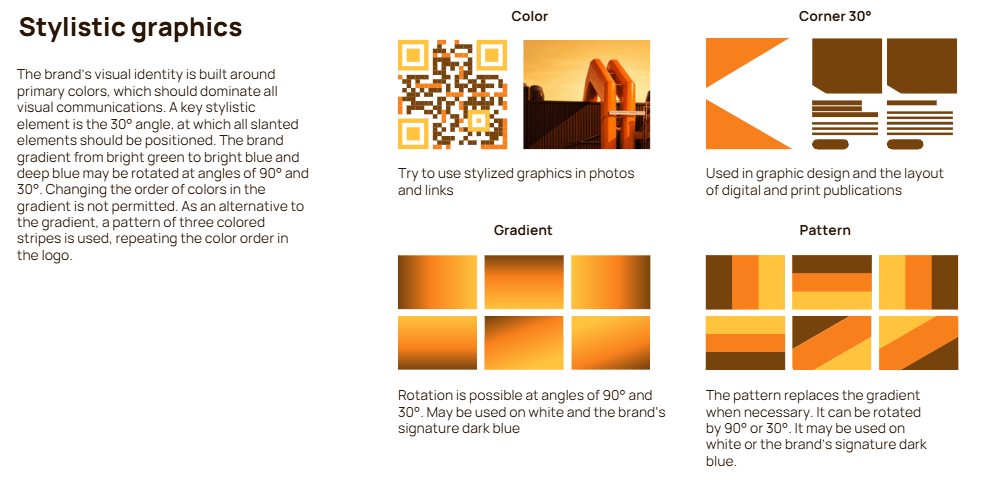

# Brand Strategy Case (B2B, Confidential)

## Overview

This project demonstrates a structured, data-driven approach to building a brand identity system for a B2B company in the food ingredients industry.

The goal was to transform fragmented branding and inconsistent communication into a unified, validated brand system that can be used across the organization.

---

## Business Problem

The company lacked a unified brand system, resulting in:

- inconsistent visual identity across products and channels  
- absence of clear brand guidelines  
- fragmented understanding of brand values  
- lack of defined positioning, mission, and communication principles  

As a result, marketing and communication decisions were made inconsistently and without a strategic foundation.

---

## Approach

The project followed a structured methodology combining qualitative research and quantitative validation:

1. **Model Selection**  
   A suitable brand identity framework (Kapferer Prism) was selected for a B2B environment.

2. **Leadership Interviews**  
   Conducted interviews to define initial brand hypotheses (values, positioning, communication).

3. **Brand Model Adaptation**  
   Transformed qualitative insights into a structured brand identity model.

4. **Employee Survey**  
   Designed and conducted an internal survey to validate brand assumptions.

5. **Data Analysis & Validation**  
   Applied scaling, average scoring, and gap analysis to identify alignment between leadership and employees.

6. **Decision Framework**  
   Classified brand elements into:
   - Brand Statement  
   - State Carefully  
   - Growth Direction  
   - Do Not Present  

7. **Brand Book Development**  
   Built a structured brand system based only on validated insights.

---

## Process Visualization

Below are selected visual materials illustrating key steps of the process:

### Model Selection

### Interviews & Data Collection

### Survey Structure

### Data Analysis & Validation

### Brand Structure

### Visual Identity (Concept)

---

## Outcome / Impact

- Established a unified and structured brand system  
- Eliminated ad-hoc branding decisions  
- Enabled consistent communication across departments  
- Created a scalable foundation for future brand development  
- Introduced a data-driven approach to brand decision-making  

---

## Key Takeaway

This project demonstrates how brand strategy can be built not only on creative assumptions, but on validated data and internal alignment.

---

## Note

Due to confidentiality, original brand materials and company-specific details are not disclosed. All examples are adapted for portfolio purposes.
